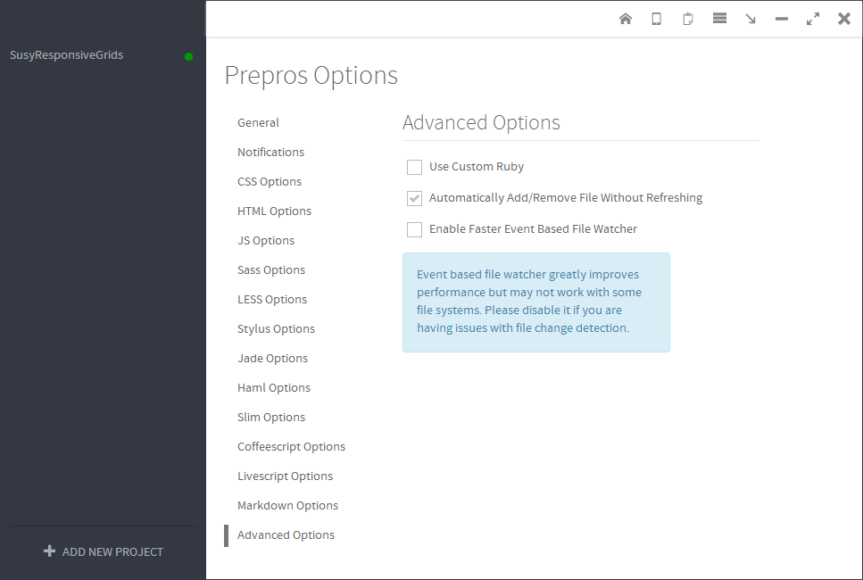
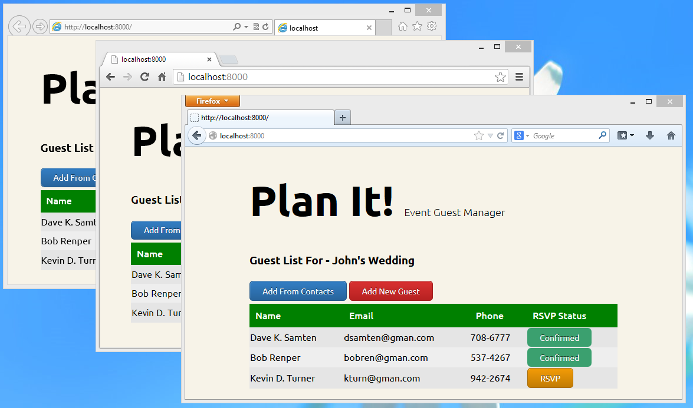

###Context

* MS Windows 8 Profesional x64
* Prepros App v.4.0.0 installed and started with administartor priviledges
* Ruby is not installed

####Notes:
 
  * if you have Ruby installed on your system you can skip steps 9, 10 and 11 of this tutorial;
  * if you have compass, susy and sassy-buttons Ruby gems installed you can skip steps 12 and 13 of this tutorial.

###Tutorial

1. Download sample code from [Responsive Grids With Susy] (http://cdn.tutsplus.com/net/uploads/legacy/2148_grids/code_download.zip) Net Tuts+ tutorial.
    
    
    
2. Unzip sample into E:\Projects\Web\Prepros\SusyResponsiveGrids (Note: you can use any other folder you like for the sample project's files).
    
    
    
3. Drag sample code's `E:\Projects\Web\Prepros\SusyResponsiveGrids` folder...
    
    
    
4. ...and drop it onto Prepros App main form
    
    
    
5. _SusyResponsiveGrids_ project will be added to the __Prepros App__ projects list.
    
    
    
6. Right-click on `SusyResponsiveGrids` project entry and select `Compile All Files` item from popup-menu or use `CTRL+SHIFT+S` (_Compile All Files_) short-cut...
    
    
    
7. ... and find `Compilation Failed` message box appearing for a few seconds in the right bottom corner of the display screen.
    
    
    
8. Open Prepros log by clicking on `App Log` toolbar button.
    
    
    
9. Figure out that you need a [Full Compass support] (http://alphapixels.com/prepros/docs/sass-compass.html) and that full Compass support requires `Ruby` installed on your system. Go and get downloaded [Ruby installation - Ruby 1.9.3-p484.exe](at http://rubyinstaller.org/downloads/).
    
    
    
10. Setup Ruby at `C:\Program Files (x86)\Ruby193`, check `Add Ruby executable to your PATH` setup option. (You have to run Ruby setup with Administrator priviledges (`Run as administrator`) to allow setup creating and writing to `C:\Program Files (x86)\Ruby193` folder. (You can select any other folder for Ruby setup - the one, which you'll have full access rights without system administrator priviledges.)
    
    
    
11. Get Ruby setup completed successfully.
    
    
    
12. Open elevated command prompt window.
    
    
    
13. Install compass, susy and sassy-buttons gems.
    
    
    
    ```
    >gem install compass susy sassy-buttons
    ```
    ```
    Fetching: sass-3.2.13.gem (100%)
    Fetching: chunky_png-1.2.9.gem (100%)
    Fetching: fssm-0.2.10.gem (100%)
    Fetching: compass-0.12.2.gem (100%)
    Successfully installed sass-3.2.13
    Successfully installed chunky_png-1.2.9
    Successfully installed fssm-0.2.10
    Successfully installed compass-0.12.2
    Fetching: susy-1.0.9.gem (100%)
    Successfully installed susy-1.0.9
    Fetching: sassy-buttons-0.2.6.gem (100%)
    Successfully installed sassy-buttons-0.2.6
    6 gems installed
    Installing ri documentation for sass-3.2.13...
    Installing ri documentation for chunky_png-1.2.9...
    Installing ri documentation for fssm-0.2.10...
    Installing ri documentation for compass-0.12.2...
    Installing ri documentation for susy-1.0.9...
    Installing ri documentation for sassy-buttons-0.2.6...
    Installing RDoc documentation for sass-3.2.13...
    Installing RDoc documentation for chunky_png-1.2.9...
    Installing RDoc documentation for fssm-0.2.10...
    Installing RDoc documentation for compass-0.12.2...
    Installing RDoc documentation for susy-1.0.9...
    Installing RDoc documentation for sassy-buttons-0.2.6...
    ```
    
14. Select Prepros Advanced Options.
    
    
    
    
    
    
        
15. Check `Use Custom Ruby` option, `For Sass` option, enter Ruby setup fullpath `C:\Program Files (x86)\Ruby193\bin\ruby.exe`.
    
    
    
16. Click on screen.scss file to get its options displayed on the right side of the Prepros form, check `Use Compass` and `Full Compass Support` options (the latter option's checkbox will appear after you'll get `Use Compass` option checked. Click `Compile` button.
    
    
    
17. Still no fun - compilation failed.
    
    
    
18. Notice that config.rb is needed.
    
    
    
19. Create config.rb file in `E:\Projects\Web\Prepros\SusyResponsiveGrids` folder.
    
    
    
    ```
    # Require any additional compass plugins here.
    require 'susy'
    require 'sassy-buttons'
    
    # Set this to the root of your project when deployed:
    http_path = "/"
    css_dir = "stylesheets"
    sass_dir = "sass"
    images_dir = "images"
    javascripts_dir = "javascripts"
    ```
    
20. Compile again - Compilation Successfull :)
    
    
    
21. Open Live Preview (Ctrl + L)...
    
    
    
22. ... and see sample site (`http://localhost:8000/`) previewed in IE. (If you have other browser as your default browser you'd have sample site previewed in that browser).
    
    
    
    If you would haven't started Prepros as administartor then you would have got `This page can't be displayed` message page from IE.
    
    
    
23. Start Chrome browser and copy and paste sample site Url `http://localhost:8000/`. (Starting Chrome browser in Administrator mode is not needed).
    
    
    
24. Start Firefox browser and copy and paste sample site Url `http://localhost:8000/`. . (Starting Firefox browser in Administrator mode is not needed).
    
    
    
25. Open screen.scss from sample project \sass subfolder.
    
    
    
    Edit:
    
    ```
       thead{
           color: #FEFEFE;
           background: #000;
    ```
    
    to
    
    ```
       thead{
           color: #FEFEFE;
           background: green;
    ```
    
    and save edits.
    
26. Wait a momment and watch `Compilation Successful` message box in the bottom right corner...
    
    
    
27. ... as well as find out that all the three browsers get sample web page tables headers' background color "automagically" changed to Green.
    
    


That's it.

Enjoy!
