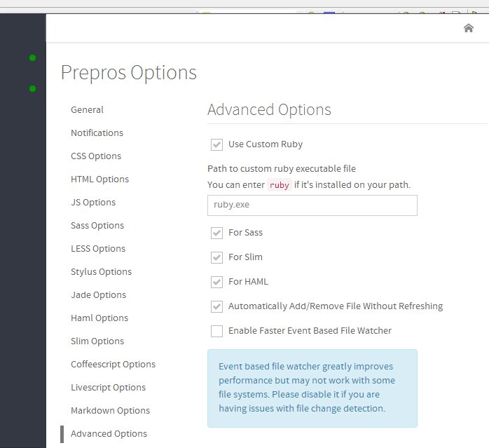

Prepros has full support for Sass and Compass.

Prepros identifies Sass and Scss files in the project folder and adds them to the list of files to compile.

Any Sass and Scss file (i.e. including partials) imported by another file are not shown in the files list 
but they are still watched by Prepose. The parent file is re-compiled whenever any of the imported files are changed.

When the Sass and Scss file is compiled, a css file is created/updated that inherits the Sass/Scss partent file name with a .css extension. If the Sass files are saved in `sass/scss` folder the output css is saved 
to user defined css folder. You can change css folder from [project options](projects.html).

You can change various file options from file options panel such as output style.


## Using Compass

###Prepros has two modes for compass support.

1. __Compass Css3 mode__ - You can use css3 features of Compass and also change the output path of file but you can't use advanced Compass functions like spriting.

2. __Full Compass support__ - In this mode you can use all the features of Compass including spriting but you can't change the output path of file from within Prepros.
You have to manage input and output folder by using your compass config.rb file. The config.rb file must be located in the root of your project folder.

### Including Compass support
Select the mode of Compass support you prefer in the file options panel. Then, just require Compass in your sass file and you are good to go.

```css
@import 'compass';

~~ Your Css ~~
```

### Using third party compass plugins

To use third party Compass plugins you have to install Sass, Compass and your third party plugins on your computer and configure Prepros to use your system Ruby to compile Sass and Compass. You can then require third plugins from your config.rb file.

To point Prepros to the Ruby installation on your system go to [options panel](config.html) > advanced tab and check `use custom ruby for sass and compass` checkbox and enter the path to your ruby.exe file.




## Using Bourbon and Neat

[Bourbon](http://bourbon.io) and Neat(http://neat.bourbon.io) come prebundled with Prepros. Just require it in your Sass file and you are good to go.

```css
@import 'bourbon';
@import 'neat';

~~ Your Css ~~
```

Boom, it works.
